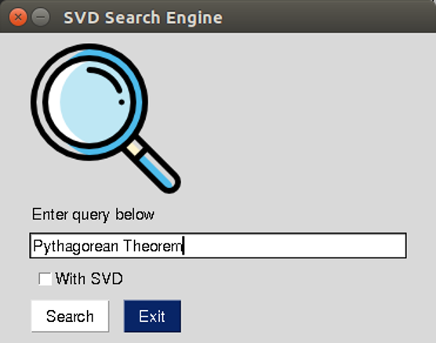
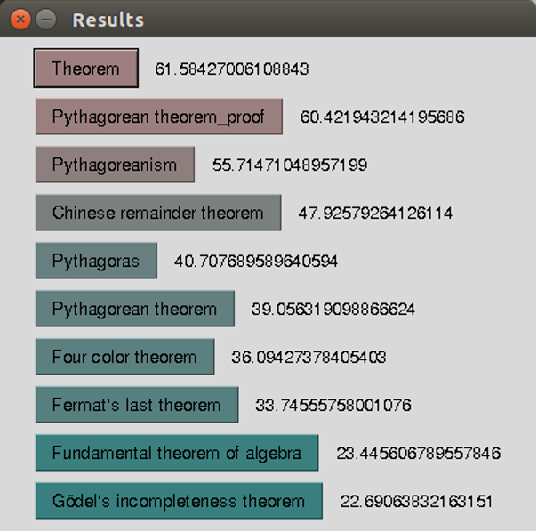

# Search Engine

Project from Computational Methods course at AGH UST. A search engine that allows user to search for most relevant articles from Simple English Wikipedia. It features a simple GUI.

It has been implemented using bag-of-words, term-document matrix and Latent Semantic Indexing.

Dataset: approx. 50 000 articles from Simple English Wikipedia *(source: github.com/LGDoor/Dump-of-Simple-English-Wiki)*.

## Data processing:

* punctuation marks removal
* stopwords removal
* stemming
* bag-of-words creation
* term frequency calculation
* *bag-of-words reduction (optional)*
* term-document matrix creation
* Inverse Document Frequency calculation
* normalization in norm L2
* SVD calculation for term-document matrix
* serialization

### Search window

### Results window

